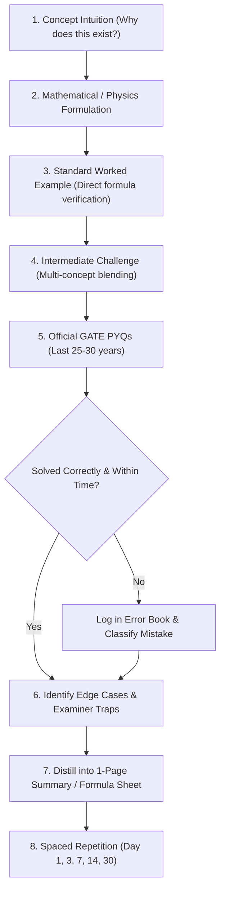

# Riyaz's Personal Career Operating System (COS)
## Complete Architectural Blueprint & Journey Specification
**Target Exam:** GATE ECE 2028 (Primary) | **Technical Career Track:** VLSI Design Verification (DV)  
**Supporting Pillars:** Professional Technical English | Japanese Language (JLPT N5 → N1)  
**Timeline:** October 2026 – June 2029 (B.Tech ECE, RGUKT RK Valley)

---

## 1. Ground Truth & Requirement Analysis

### 1.1 Reality Check & Environmental Constraints
* **Current Standing (Oct 2026):** 18 years old, B.Tech ECE (2nd Year, 1st Semester), CGPA ~8.0 at RGUKT RK Valley. 
* **Current Academic Semester Ends:** November 2026 (~7-8 weeks remaining).
* **Current Subjects:** Digital Logic Design (+ Lab), Digital Signal Processing (+ Lab), Control Systems, IoT (+ Lab).
* **Available Budget:** 2 hours/day for GATE on normal college days; micro-sessions (15-20 min) for English and Japanese. Low-data, offline-friendly, modest laptop hardware.
* **Target GATE:** GATE 2028 (February 2028, when in 3rd year). Exactly **16 months** from October 2026.
* **Mathematical Feasibility:** 16 months $\times$ ~60 hours/month (average factoring weekends & holidays) $\approx$ **950–1,050 study hours**.
  * Industry standard for GATE ECE top 500 rank: **800–1,000 disciplined hours**.
  * **Conclusion:** Highly feasible, **provided** College-GATE overlap is maximized and syllabus fragmentation is eliminated.

### 1.2 Official GATE Facts vs. Assumptions vs. 2028 Verification Checkpoints

| Category | Item | Current Official Status (Grounded) | Action / Verification Needed |
| :--- | :--- | :--- | :--- |
| **Official Fact** | Paper Structure | 65 Questions, 100 Marks, 3 Hours, CBT. | Standard across all recent organizing IITs. |
| **Official Fact** | Mark Distribution | General Aptitude: 15 Marks, Engg Mathematics: ~13 Marks, Core ECE: ~72 Marks. | Core ECE covers 8 distinct sections. |
| **Official Fact** | Question Types | MCQ (1/3 or 2/3 negative marking), MSQ (No negative), NAT (No negative). | MSQs require conceptual depth; cannot guess. |
| **Official Fact** | Virtual Calculator | On-screen virtual calculator (standard non-programmable functions, no physical calc). | Must practice exclusively on virtual calculator UI. |
| **Official Fact** | 3rd Year Eligibility | Students in 3rd year of undergraduate degree are officially eligible to appear. | Validated since GATE 2021 onwards. |
| **Assumption** | Syllabus Continuity | GATE 2028 syllabus will remain 95%+ identical to the latest official syllabus. | Minor topic weight shifts occur; core subjects do not change. |
| **To Verify (July 2027)** | Organizing Institute | Will be announced around July 2027 (e.g., IIT Bombay / IIT Delhi / IIT Kharagpur). | Check organizing institute trends & sample paper. |
| **To Verify (Aug 2027)** | Official 2028 Brochure | Release of official information brochure and syllabus PDF. | Cross-check for newly added/deleted subtopics. |

---

## 2. Pillar Dependency Graph & Overlap Engine

```mermaid
flowchart TD
    subgraph Math_Foundation["Mathematical Foundation"]
        M1["Calculus & Linear Algebra"]
        M2["Differential Equations & Vector Analysis"]
        M3["Probability & Random Variables"]
    end

    subgraph Core_ECE_Signal["Signals & Systems Spine"]
        SS["Signals & Systems\n(LTI, Transforms)"]
        DSP["DSP (College Sem 2-1)\n(Z-Trans, Filters)"]
        CS["Control Systems (Sem 2-1)\n(Time/Freq Response, Stability)"]
        COMM["Analog & Digital Communications\n(Noise, Modulation, Info Theory)"]
    end

    subgraph Core_ECE_Circuits["Circuits & Devices Spine"]
        NET["Network Theory\n(Theorems, Transients, Two-Port)"]
        EDC["Electronic Devices (EDC)\n(Semiconductors, P-N, BJT, MOS)"]
        ANA["Analog Circuits\n(Op-Amps, Amplifiers, Biasing)"]
        EMFT["Electromagnetics\n(Maxwells, Transmission Lines)"]
    end

    subgraph Digital_To_DV["Digital Logic to VLSI DV Spine"]
        DLD["Digital Logic Design (Sem 2-1)\n(K-Maps, Combinational, Sequential)"]
        VER["Verilog HDL & Simulation\n(RTL modeling, Testbenches)"]
        RTL["RTL Design & Architecture\n(FSMs, Datapath, Pipelines)"]
        SV["SystemVerilog for Verification\n(OOP, Interfaces, Randomization)"]
        SVA_COV["Assertions (SVA) & Functional Coverage"]
        PROT["Protocols: APB, AXI4-Lite, UART"]
        UVM["UVM (Universal Verification Methodology)\n(UVM Components, Sequences, Scoreboards)"]
        DV_PROJ["Industry-Grade Verification Projects\n(Portfolio & Capstone)"]
    end

    %% Dependencies
    M1 --> SS
    M2 --> SS
    M2 --> CS
    M3 --> COMM
    SS --> DSP
    SS --> CS
    SS --> COMM
    NET --> ANA
    EDC --> ANA
    M2 --> EMFT

    %% Digital into DV
    DLD --> VER
    VER --> RTL
    RTL --> SV
    SV --> SVA_COV
    SV --> PROT
    SVA_COV --> UVM
    PROT --> UVM
    UVM --> DV_PROJ

    style DLD fill:#10b981,stroke:#047857,color:#ffffff,stroke-width:2px
    style CS fill:#10b981,stroke:#047857,color:#ffffff,stroke-width:2px
    style DSP fill:#10b981,stroke:#047857,color:#ffffff,stroke-width:2px
    style UVM fill:#6366f1,stroke:#4338ca,color:#ffffff,stroke-width:2px
    style DV_PROJ fill:#8b5cf6,stroke:#6d28d9,color:#ffffff,stroke-width:2px
```



### 2.1 College + GATE + DV High-Value Overlap Matrix

| Academic Topic (2nd Year) | GATE Relevance | DV Career Relevance | Overlap Class | Strategic Action |
| :--- | :--- | :--- | :--- | :--- |
| **Digital Logic (Combinational: Adders, MUX, Decoders)** | High (~4-6 Marks) | Fundamental (Datapath logic) | **TRIPLE VALUE** ⭐⭐⭐ | Master in College + solve 100% GATE PYQs immediately + write Verilog module. |
| **Digital Logic (Sequential: FSMs, Flip-Flops, Setup/Hold)** | High (~4-6 Marks) | Paramount (Timing, Clocking, State) | **TRIPLE VALUE** ⭐⭐⭐ | Solve all GATE timing & FSM PYQs + simulate Moore/Mealy FSMs. |
| **Control Systems (Transfer Functions, Routh-Hurwitz, Nyquist, Bode)** | High (~8-10 Marks) | Low (System level only) | **GATE + COLLEGE** ⭐⭐ | Clear college exams with 9.0+ grade while completing all GATE PYQs. |
| **Digital Signal Processing (Z-Transform, DFT, FFT, Filters)** | Medium-High (~5-7 Marks in Signals) | Medium (DSP RTL Accelerators) | **GATE + COLLEGE** ⭐⭐ | Study Signals & Systems fundamentals first, then map Z-transform to DSP. |
| **Network Theory (Theorems, Transients, AC Resonance)** | High (~8-10 Marks) | Low (RTL is digital abstraction) | **GATE CORE** ⭐⭐ | Master early as foundational circuit mechanics for Analog & EDC. |
| **Verilog HDL / SystemVerilog** | Nil (Not in GATE) | Primary (The core language of DV) | **DV CORE** ⭐⭐ | Keep in dedicated weekly 2-3 hour weekend blocks so GATE is not disturbed. |

---

## 3. Four-Pillar Execution Rules & Time Budgets

The system operates on an immutable hierarchy:
$$\text{Pillar 1 (GATE ECE)} > \text{Pillar 2 (Design Verification)} > \text{Pillar 3 (English)} > \text{Pillar 4 (Japanese)}$$

```
+-----------------------------------------------------------------------------------+
| PRIORITY ARBITER                                                                  |
| When energy/time is abundant: P1 (GATE) + P2 (DV) + P3 (English) + P4 (Japanese)  |
| When time is tight (Normal College): P1 (GATE 2h) + P3 (10m) + P4 (10m)          |
| When college exams arrive: College Prep (which covers GATE overlaps) + Maintenance|
| When completely exhausted: Low-Energy Protocol (20m Maintenance)                  |
+-----------------------------------------------------------------------------------+
```

### 3.1 Daily System Operating Modalities

```mermaid
flowchart TD
    DayStart([Start of Day]) --> EnergyCheck{Energy & Schedule Mode?}
    
    EnergyCheck -->|Normal Day ~2.5 hrs| Normal[P1: GATE 2 hrs\n- 40m Concept/Notes\n- 60m Problems/PYQs\n- 20m Error/Revision\nP3: English 10m (Explain Concept Aloud)\nP4: Japanese 10m (10 Anki Words)]
    
    EnergyCheck -->|Busy College Day ~1.5 hrs| Busy[P1: GATE 75m Focused Problems/PYQs\nP3+P4: English + Japanese Combined 15m]
    
    EnergyCheck -->|Weekend / Holiday ~4-5 hrs| Weekend[P1: GATE Deep Work 3 hrs\n- Hard Problems & Chapter Test\nP2: DV Studio 1.5 hrs\n- Verilog/SV Lab Simulation\nP3+P4: English Tech Summary + 15 Vocab]
    
    EnergyCheck -->|College Exam Week ~30m| ExamSeason[College Academic Study 100%\nP1: GATE Maintenance (15m Formula Recall)\nP4: Japanese 10m Streak Saver (10 Vocab)]
    
    EnergyCheck -->|Exhausted / Low Energy ~20m| LowEnergy[Minimum Viable Day (MVD):\n- 10m Review 5 Error Book items\n- 5m Verbal English Summary\n- 5m Quick Japanese Flashcards]
```

---

## 4. Master Journey Timeline (2026 – 2029)

```mermaid
flowchart LR
    subgraph Y2026["2026: Foundation & College Sync"]
        P0["Phase 0: Sem 2-1 (Oct-Dec 2026)\n- Overlap: DLD + Control Systems + DSP\n- GATE Math: Linear Algebra\n- Japanese: Kana + 500 Vocab\n- Eng: Concept-aloud Habit"]
    end

    subgraph Y2027["2027: Syllabus Conquest & DV Fundamentals"]
        P1["Phase 1: Sem 2-2 (Jan-May 2027)\n- GATE: Networks + Signals + EDC\n- DV: Verilog RTL + Testbenches\n- Japanese: Basic Grammar (Genki I / N5)\n- Eng: Technical Walkthroughs"]
        P2["Phase 2: Sem 3-1 (Jun-Nov 2027)\n- GATE: Analog + EMFT + Comms + Math\n- DV: SystemVerilog OOP & Constrained Random\n- Japanese: JLPT N5 Complete -> N4 Start\n- Eng: Mock Verbal Answers"]
    end

    subgraph Y2028["2028: The GATE War & DV Specialization"]
        P3["Phase 3: GATE 2028 Peak (Dec 2027-Feb 2028)\n- 100% Focus: Mocks, Revision, PYQs\n- DV & Japanese on Maintenance"]
        P4["Phase 4: Sem 3-2 (Feb-May 2028)\n- DV Surge: SVA, Functional Coverage, APB/AXI\n- UVM Architecture\n- GATE 2028 Result Evaluation"]
        P5["Phase 5: Sem 4-1 (Jun-Nov 2028)\n- Advanced UVM Project Ladder\n- GitHub Portfolio + Verification Reports\n- Japanese: N4/N3 Transition\n- Campus / Off-campus DV Hiring Drive"]
    end

    subgraph Y2029["2029: Career Launch & Graduation"]
        P6["Phase 6: Sem 4-2 (Dec 2028-May 2029)\n- Option A: Core VLSI DV Role Secured\n- Option B: GATE 2029 (Improvement)\n- Graduation with 8.0+ CGPA\n- Japanese N3+ Practical Ability"]
    end

    P0 --> P1 --> P2 --> P3 --> P4 --> P5 --> P6
```



---

## 5. GATE Learning & Mastery Pipeline

Every single GATE topic must follow this exact 10-step progression. Never skip straight to passive video watching.



### 5.1 PYQ Tracking & Error Book Mechanics
Every mistake made in practice or mock tests is entered into the Error Book with a strict taxonomy:

1. **Type 1: Concept Gap** – Did not know the fundamental physics/mathematical theorem. (Action: Re-read reference textbook section).
2. **Type 2: Formula / Sign Mistake** – Forgot a factor of $2$, flipped $\pm$, or confused radians vs Hertz. (Action: Flashcard drill).
3. **Type 3: Virtual Calculator / Arithmetic Error** – Miskeyed parenthesis or rounding off early. (Action: Mandatory practice with on-screen calculator only).
4. **Type 4: Question Interpretation / Silly Error** – Missed "NOT true", misread units (e.g. mA vs $\mu$A, ns vs ps). (Action: Highlight keywords rule).
5. **Type 5: Time Trapped** – Spent $>6$ minutes on a dead-end question. (Action: Two-pass exam technique training).

---

## 6. VLSI Design Verification (DV) Curriculum & Project Ladder

```mermaid
flowchart TD
    subgraph Foundation["Stage 1 - 4: RTL Foundations (Sem 2-1 to 2-2)"]
        D1["Digital Logic Truths (Setup/Hold, Metastability, FSMs)"]
        D2["Verilog HDL (Synthesizable RTL vs Non-synthesizable Testbench)"]
        D3["Basic Projects: Synchronous/Asynchronous FIFO, UART Controller"]
    end

    subgraph SV_OOP["Stage 5 - 10: SystemVerilog for Verification (Sem 2-2 to 3-1)"]
        D4["SystemVerilog Data Types (Logic, Bit, Associative Arrays, Queues)"]
        D5["OOP Concepts for Verification (Classes, Inheritance, Polymorphism, Handles)"]
        D6["Constrained Random Verification (rand, randc, solve...before, dist)"]
        D7["SystemVerilog Assertions - SVA (Immediate & Concurrent, Sequence, Property)"]
        D8["Functional Coverage (Covergroups, Coverpoints, Cross Coverage, Bins)"]
    end

    subgraph Advanced_UVM["Stage 11 - 15: Protocols & UVM (Sem 3-2 to 4-1)"]
        D9["Industry Protocols: APB Bus, AXI4-Lite, SPI"]
        D10["UVM Architecture: uvm_driver, uvm_monitor, uvm_sequencer, uvm_agent, uvm_env"]
        D11["TLM Communication (Ports, Exports, FIFOs) & Factory Overrides"]
        D12["UVM Sequences, Virtual Sequencers, and Scoreboards"]
    end

    subgraph Capstone["Stage 16 - 18: Industry-Grade Projects & Portfolio (Sem 4-1 to 4-2)"]
        P_FIFO["Project 1: Dual-Clock Asynchronous FIFO SV Verification Env"]
        P_APB["Project 2: Complete APB Protocol Compliant Verification IP (VIP)"]
        P_UVM["Project 3 (Capstone): Full UVM Verification Environment for AXI-to-APB Bridge or Network Router\n- 100% Functional & Code Coverage\n- Constrained Random Testing\n- Comprehensive SVA Assertions\n- Automated Regression Scripts"]
    end

    Foundation --> SV_OOP --> Advanced_UVM --> Capstone
```



---

## 7. English & Japanese Continuous Engines

### 7.1 English Communication (Daily 10-Minute Frictionless Loop)
* **The "Feynman-in-English" Rule (5–7 mins daily):**
  * Immediately after solving a GATE problem or writing an RTL module, Riyaz must explain the concept aloud in English to an imaginary junior or interviewer for 90 seconds without pausing.
  * *Prompt:* "Why does a reverse-biased P-N junction exhibit capacitance?" or "Explain the difference between a Mealy and Moore machine."
* **Sentence Formation & Grammar Refinement (3 mins daily):**
  * One paragraph technical reflection written in English in the daily log: "Today I verified the setup time equation..."
* **Milestone Ladder:**
  * Milestone 1 (Month 1): Confident 90-second technical concept delivery without Hindi/Telugu filler words.
  * Milestone 2 (Month 3): Fluid self-introduction + academic trajectory narrative.
  * Milestone 3 (Month 6): Explaining RTL simulation waveforms and bugs verbally in English.
  * Milestone 4 (Pre-placement): Flawless technical and HR mock interview walkthrough.

### 7.2 Japanese Mastery (10 Words/Day Sustainable Engine)
* **Daily Time Box:** Strict 10–15 minutes max (Never allowed to eat into GATE study).
* **Progression Pipeline:**
  * **Phase A (Months 1–2 / Oct–Nov 2026):** Hiragana + Katakana mastery + Daily 10 Core N5 Vocab (Target: 300 words).
  * **Phase B (Months 3–6 / Dec 2026–Mar 2027):** Tae Kim’s basic grammar / Genki I + Kanji radicals (Target: 600 words + 80 Kanji).
  * **Phase C (Months 7–10 / Apr–Jul 2027):** Complete N5 past papers + listening practice (Target: 800 words + 100 Kanji).
  * **Phase D (Month 11 / Dec 2027):** Appear for official **JLPT N5**.
  * **Phase E (2028):** Steady progression into **JLPT N4** (Target: 1,500 words + 300 Kanji).
  * **Phase F (2029):** Intermediate **JLPT N3** (Gateway to Japanese tech multinational hiring / overseas opportunities).

---

## 8. Backlog Recovery & Resilience Triage System

When life happens and study stalls, the system never tells Riyaz to "work 14 hours tomorrow". It executes mathematically planned triage:

```mermaid
flowchart TD
    BacklogDetected{Backlog Duration?}
    
    BacklogDetected -->|1 Day Lost| B1["Single-Day Buffer Recovery:\n- Absorb into the upcoming Sunday revision buffer (2h allocated).\n- Do NOT increase daily hours on weekdays."]
    
    BacklogDetected -->|3 Days Lost| B3["3-Day Surgical Triage:\n- Freeze new topic theory.\n- Solve only top 20 core PYQs for the missed topic.\n- Push remaining non-essential practice to month-end consolidation."]
    
    BacklogDetected -->|1-2 Weeks (Illness / Mid-terms)| B7["Macro Re-alignment:\n- Categorize pending topics into 'GATE High Yield' vs 'Low Yield'.\n- Cover High-Yield (e.g., Eigenvalues, Op-Amps, State Machines) at normal depth.\n- Move Low-Yield to formula-only pass.\n- Resume the calendar; never drag a dead schedule forever."]
    
    BacklogDetected -->|College Semester Finals (3-4 Weeks)| BExam["Exam Ramp Protocol:\n- Zero guilt: Semester GPA (8.0+) is a hard prerequisite for VLSI companies.\n- 15m/day maintenance only.\n- Day after finals: 2-day recalibration weekend, then restart normal pace."]
```

---

## 9. Comprehensive Data Architecture & State Schema

The web dashboard and planning engine will be powered by a local, offline-first JSON structure stored in browser `localStorage` or exported as clean JSON.

```json
{
  "user_profile": {
    "name": "Riyaz",
    "age": 18,
    "degree": "B.Tech ECE",
    "college": "RGUKT RK Valley",
    "cgpa": 8.0,
    "current_semester": "2-1",
    "target_exam": "GATE ECE 2028",
    "contingency_exam": "GATE ECE 2029",
    "career_target": "VLSI Design Verification Engineer"
  },
  "pillars": {
    "gate": {
      "target_date": "2028-02-05",
      "daily_target_minutes": 120,
      "syllabus_sections": [
        {
          "id": "EM",
          "name": "Engineering Mathematics",
          "weightage_marks": 13,
          "status": "in_progress",
          "topics": [
            {"id": "EM-LA", "name": "Linear Algebra", "status": "in_progress", "pyqs_solved": 45, "pyqs_total": 85, "mastery_score": 75},
            {"id": "EM-CALC", "name": "Calculus", "status": "not_started", "pyqs_solved": 0, "pyqs_total": 90, "mastery_score": 0}
          ]
        },
        {
          "id": "DLD",
          "name": "Digital Circuits",
          "weightage_marks": 9,
          "overlap_type": "TRIPLE_VALUE",
          "college_course_code": "EC2101",
          "status": "active"
        }
      ],
      "pyq_tracker": [
        {
          "id": "PYQ-DLD-2023-01",
          "subject": "Digital Circuits",
          "topic": "Counters / Sequential",
          "year": 2023,
          "marks": 2,
          "type": "NAT",
          "solved_date": "2026-10-04",
          "result": "incorrect",
          "time_taken_sec": 240,
          "error_type": "Formula_Sign",
          "revisit_date": "2026-10-07"
        }
      ],
      "error_book": [
        {
          "id": "ERR-001",
          "date": "2026-10-04",
          "subject": "Digital Circuits",
          "question_ref": "GATE 2023 Q34",
          "mistake_category": "Type 2: Formula / Sign Mistake",
          "root_cause": "Forgot to account for propagation delay of first flip-flop in ripple counter",
          "corrective_rule": "In ripple counters, total settling time = N * t_pd; clock period must exceed this.",
          "review_intervals": [1, 3, 7, 14, 30],
          "current_interval_index": 0,
          "next_review": "2026-10-05"
        }
      ]
    },
    "vlsi_dv": {
      "current_stage": "Stage 1: Digital Logic & Hardware Modeling",
      "active_project": "Dual-Clock FIFO Verilog Design & Self-Checking Testbench",
      "skills_matrix": [
        {"skill": "Verilog RTL Modeling", "level": "Intermediate", "verified": true},
        {"skill": "SystemVerilog OOP", "level": "Beginner", "verified": false},
        {"skill": "UVM Architecture", "level": "Locked", "verified": false}
      ]
    },
    "english": {
      "daily_streak": 3,
      "last_verbal_topic": "Explain setup and hold time violation consequences in RTL",
      "weekly_challenge": "Deliver a 3-minute recorded audio explaining Moore vs Mealy state machines."
    },
    "japanese": {
      "start_date": "2026-10-02",
      "daily_rate": 10,
      "words_learned": 30,
      "current_level": "Hiragana / Katakana + Basic Vocab",
      "target_jlpt": "N5 (Dec 2027)"
    }
  },
  "today_schedule": {
    "date": "2026-10-04",
    "mode": "normal_college_day",
    "tasks": [
      {"id": "T1", "pillar": "GATE", "desc": "Solve 10 PYQs on Combinational Multiplexers", "duration_min": 60, "done": false},
      {"id": "T2", "pillar": "GATE", "desc": "Linear Algebra: Eigenvalues & Cayley-Hamilton Notes", "duration_min": 60, "done": false},
      {"id": "T3", "pillar": "English", "desc": "90s verbal explanation: Why MUX is universal logic?", "duration_min": 10, "done": false},
      {"id": "T4", "pillar": "Japanese", "desc": "Learn 10 new N5 Vocab (Numbers & Family) + Kana check", "duration_min": 10, "done": false}
    ]
  }
}
```

---

## 10. Dashboard Structure & Implementation Roadmap

### 10.1 UI/UX Screen Architecture
1. **Home / Command Center:**
   * Dynamic GATE 2028 Countdown timer (Days, Hours).
   * Today's Mission & Active Modality Selector (Normal, Busy, Low Energy, Exam Week).
   * Daily 4-Pillar Checklist (Interactive checkoffs + streak counter).
   * Quick-launch buttons: Add Error Book Entry, Log 10 Japanese Words, Record English Topic.
2. **GATE Engine:**
   * Interactive Syllabus Progression Tree (8 Core Sections + Math + Aptitude) with College Overlap badges.
   * Direct PYQ tracker with filtering by subject, year, and difficulty.
   * The Error Book (Categorized by 5 mistake types with Spaced Review countdowns).
   * Test Analytics view (Accuracy, NAT vs MCQ error analysis).
3. **VLSI DV Studio:**
   * 18-Stage Roadmap visualizer (from Digital Gates to UVM).
   * Project Ladder tracker with GitHub repository checklist, protocol specs, and testbench verification status.
4. **Language Wing:**
   * English Daily Speaking Prompt Generator & Vocabulary Vault.
   * Japanese Progress Bar: Words count (target: 800 for N5), Kana Mastery, Grammar checkpoints.
5. **Diagnostics & Triage (Recovery Mode):**
   * Instant backlog recovery calculator (Input days missed $\rightarrow$ Generates realistic redistributed plan without increasing daily burnout).

---

## 11. Proposed First Implementation Milestone

1. **Architecture & Foundation Setup:** Initialize a clean, ultra-responsive, offline-capable dashboard in the workspace.
2. **State & Core Engine:** Implement the complete Career Operating System data schema with default progression data seeded directly from Riyaz's current 2nd-year position.
3. **Interactive Daily Command Deck:** Render the interactive "Today" interface, the Four-Pillar trackers, the GATE 2028 War Countdown, and the College-Overlap Matrix.
4. **Verification & Delivery:** Validate zero network dependencies, blazing speed, and mobile/desktop responsive rendering.
